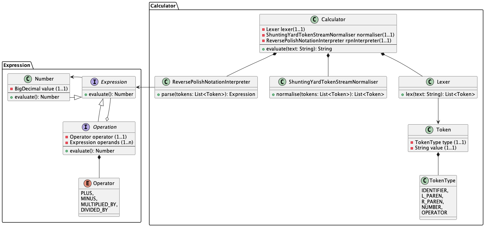

# tdd-calculator-dsl-kata

## Rationale
I tried this exercise originally as a mean to experiment with mixing math, 
algorithms, language design and test driven development.

I wanted to propose it to a group of attendants to try out test driven development on a
relatively complex problem. Unfortunately this exercise expose the limitations of TDD more
than highlighting its values:
- TDD facilitates the internal design of the code by producing code that is simple to read
and to maintain, but not the overall design of the solution.
- TDD doesn't help finding out the solution when the algorithm is non-trivial. The knowledge of
the algorithm itself is fundamental in this case, and it may be easier to write it first and
test last. I must add that in any case, applying the TDD mindset on an algorithm (shunting yard)
which has been provided to me by ChatGPT, it helped me find out mistakes and correcting them.
- The cognitive load of this exercise proved to be excessive for a group of attendants
that wish to learn TDD.

## What it does:
It receives an expression in text form, such as:
~~~
2 + 3 * 6
~~~

and it returns its result:
~~~
20
~~~

It's also able to compute nested expressions:
~~~
2 + (1 * (0 - 3))
~~~
~~~
-1
~~~

In case the expressions contain errors, like a division by zero or an incomplete expression, such as:
~~~
1 +
or
1 / 0
or 
(2 * ))
~~~

it will return:
~~~
error
~~~

It can also execute s-espressions but currently limited to two operands per expression, such as
~~~
(+ 2 (* 2 2))
~~~

~~~
6
~~~

## How it does it
First a text representing an expression is tokenised.
~~~
1 * (2 + 3)
~~~

will produce these tokens:
~~~
[number("1"), operator("*"), left_parenthesis("("), operator("+"), number("3"), right_parenthesis(")")]
~~~

Second, this token stream is rearranged and compacted to Reverse Polish Notation, using
the Shunting Yard algorithm. This operation takes care of operators precedence.
The output of applying the algorithm to the aforementioned token stream is:

~~~
[number("1"), number("2"), operator("*"), number("3"), operator("+")]
~~~

Third, this rearranged token stream is given to an interpreter that computes the expression. 
The algorithm looks something like this:
~~~
for each token in the stream:
    if token is operand:
        - push to operand on the head of the stack
    
    if token is operator:
        - read and remove (pop) the first two values from the head of the stack
        - apply the operator to the two values and push its result on the stack
        
--
The value at the head of the stack is the result of the expression.
~~~

## Model
